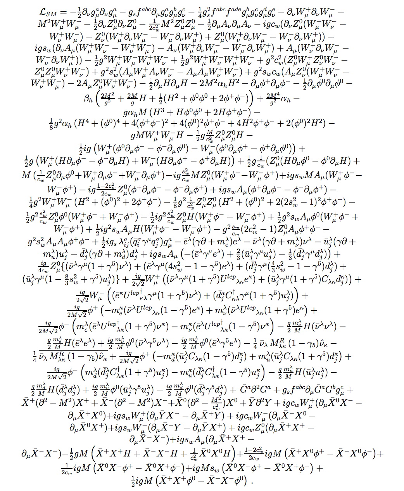
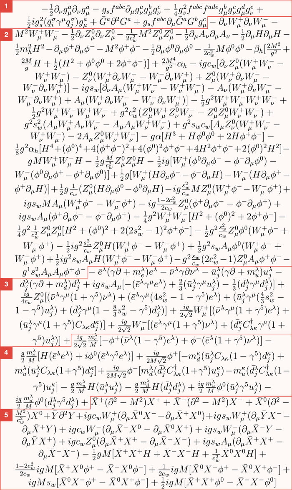

# Standard Lagrangian model


The standard model is extremely complex and intricate. Most likely previous study in particle physics and multivariable calculus will be needed. I can not do this formula justice; it is perhaps the most important formula ever made.


<figure><picture><source srcset="../../../.gitbook/assets/Standard-model.webp" media="(prefers-color-scheme: dark)"></picture><figcaption>
The Standard Model Lagrangian equation, which describes the dynamics of fundamental particles and their interactions, excluding gravity.
</figcaption></figure>

The formula is perhaps the most important and influential of physics. The formula describes the fundamental motion of particles and the interactions between forces. The formula is perhaps considered one of the most important physical discoveries of mankind.&#x20;

Bosons

Bosons are force-carrying particles, and there are four species of bosons that interact with other particles using three fundamental forces. Photons carry electromagnetism, gluons carry the strong force and W and Z bosons carry the weak force. The most recently discovered boson, the Higgs boson, is a bit different.

<figure><figcaption>
The formula split into sections
</figcaption></figure>

The formula is a quantum field theory which means that its fundamental objects are in quantum fields.&#x20;

The Standard Model of particle physics is a complex theory that describes the fundamental forces of nature and the elementary particles that make up all matter. It is one of the most successful theories in physics, and it has been confirmed by many experiments.

The Standard Model is based on the Lagrangian formalism, which is a mathematical framework for describing physical systems. The Lagrangian is a function that describes the energy of a system, and it can be used to derive the equations of motion for the system.

The Lagrangian for the Standard Model is a very complex expression, but it can be written in a compact form using the following notation:

$$
L = L_{fermion} + L_{gauge} + L_{higgs}
$$

The first term, L\_fermion, describes the kinetic energy of the fermions, which are the elementary particles that make up matter. The second term, L\_gauge, describes the interactions between the fermions and the gauge bosons, which are the force carriers of the fundamental forces. The third term, L\_Higgs, describes the interaction between the fermions and the Higgs boson, which is a scalar particle that gives mass to the fermions.

The Higgs boson, often referred to as the Higgs particle, is a fundamental component of the Standard Model of particle physics. It arises from the quantum excitation of the Higgs field. As a massive scalar boson, it possesses zero spin, positive parity, no electric charge, and is colorless. The Higgs boson interacts with mass and is highly unstable, decaying swiftly into other particles.

The Higgs field is a scalar field with two neutral and two electrically charged components that form a complex doublet of the weak isospin SU(2) symmetry. Its "Sombrero potential" leads it to take a nonzero value _everywhere_ (including otherwise empty space), which breaks the weak isospin symmetry of the electroweak interaction and, via the Higgs mechanism, gives a rest mass to all massive elementary particles of the Standard Model, including the Higgs boson itself. The existence of the Higgs field became the last unverified part of the Standard Model of particle physics, and for several decades was considered "the central problem in particle physics".
