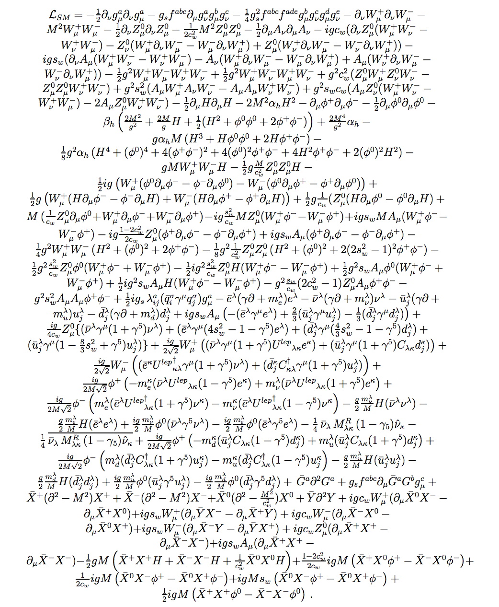

# Standard Lagrangian model.

<figure><figcaption></figcaption></figure>

The standard model is used to describe the interaction between the fundamental forces as well as the interaction of their corresponding particles.

### Background

A photon is the particle that carriers the Electromagnetic forces. Light can exist as a wave or a particle; the characteristic of visible light is light of a specific wavelength. A photon can be simplify described as a pocket or capsule of energy. Einsteins theory of special relativity states
