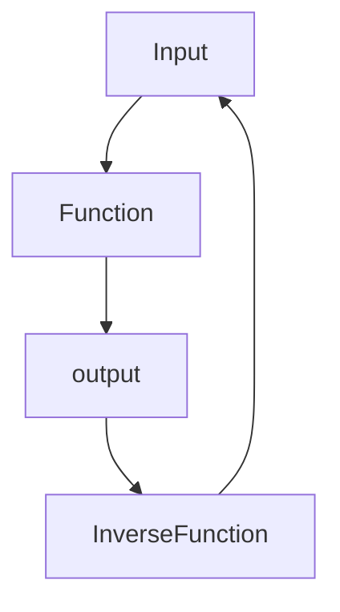

# Inverse functions

A mermaid diagram to show Inverse function is what follows:

```mermaid
flowchart TB
    Input["Input"] --> Function["Function"]
    Function --> output["output"]
    output --> InverseFunction["InverseFunction"]
    InverseFunction --> Input
```
